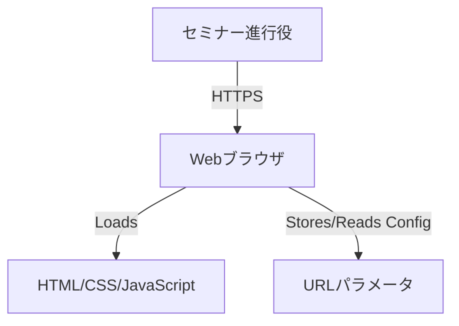

# **設計ドキュメント： Seminar Timekeeper**

## **1. 基本設計**

### **1.1. プロジェクト概要**

  * **目的と解決する課題:**
      * オンラインセミナーの進行役が、複雑な操作なしに直感的に時間管理を行えるようにする。
      * 各パート（コーナー）の進行状況（遅延・前倒し）をリアルタイムで可視化する。
      * 進行状況の把握を容易にし、進行役が話す内容や速度の調整を支援する。
  * **ターゲットユーザー:**
      * オンラインセミナーやイベントの進行役、司会者。
      * ITリテラシーに関わらず、セミナー中でも一目で情報を把握できるシンプルなUIを求めるユーザー。

### **1.2. 機能要件**

  * **設定モード機能**
      * パートの追加・削除ができる。
      * 各パートの名称と割り当て時間（分単位）を設定できる。
      * 入力値のフォーカスが外れた時点で設定が即時反映され、実行モードにも自動で同期される。
      * 実行モードで計測中に設定が変わった場合は全タイマーが初期状態に戻る。
      * 設定全体の合計所要時間を設定モード上部に表示する。
      * 設定内容をURLパラメータとして保存・共有できる。（例: `https://example.com/?config=...`）
      * URLに設定パラメータが存在する場合、その内容を読み込んで画面に復元できる。
  * **実行モード機能**
      * 設定された全パートの名称と割り当て時間の一覧を表示する。
      * 各パートの隣に「開始」ボタンを配置する。
      * 全体のタイマーを操作するための「停止」「再開」ボタンを配置する。
  * **タイマー機能**
      * いずれかの「開始」ボタンを押すと、該当パートと全体のタイマーが同時に開始される。
      * あるパートの進行中に、別のパートの「開始」ボタンを押すと、前のパートのタイマーは停止し、新しいパートのタイマーが開始される。この時、全体のタイマーは停止せず継続してカウントアップする。
      * 「停止」ボタンを押すと、現在進行中のパートと全体のタイマーが一時停止する。
      * 「再開」ボタンを押すと、一時停止した両方のタイマーが再開される。
  * **表示機能**
      * 現在進行中のパートの「経過時間」と「残り時間」を `MM:SS` 形式でリアルタイムに表示する。
      * 全体の「総経過時間」と「総残り時間」を `MM:SS` 形式でリアルタイムに表示する。
      * 割り当て時間を超過した場合、残り時間はマイナス表記（例: `-00:15`）で表示を続ける。
      * 各パートおよび全体の進行状況を視覚的に示すプログレスバーを表示する。
      * パートの残り時間が指定した閾値（例: 1分）を下回ると、該当パートの背景色が変わるなどの視覚的アラートを表示する。
      * 全体の「総経過時間」セクションはスクロールしても常に画面上部に表示される（sticky/fixed 表示）。
      * 完了済みパートの合計予定時間と実際の総経過時間を比較し、全体の進捗が計画より何分早い／遅いかを表示する（現在進行中のパートは予定通り進行している前提で算出）。
      * あるパートの開始操作を行うと、それまで進行していたパートは「完了」とみなし、割当時間全体を計画消化時間として扱う。途中で別パートに戻った場合は保存済みの経過時間から再開し、再び離れるとその時点までの経過時間が保持される。

### **1.3. 非機能要件**

  * **UI/UX:** セミナーの最中でも一目で理解できる、シンプルで直感的なデザインを採用する。
  * **レスポンシブ対応:** PC、スマートフォン、タブレットの各画面サイズで表示と操作が最適化されること。
  * **パフォーマンス:** ページ読み込みが高速であり、タイマーの動作が正確で遅延がないこと。
  * **ブラウザ互換性:** 主要なモダンブラウザ（Google Chrome, Firefox, Safari, Microsoft Edge）の最新バージョンに対応すること。
  * **可用性:** バックエンドを持たない静的サイトのため、静的ホスティングサービスが稼働している限り利用可能であること。
  * **計測/分析:** 利用状況を把握するため、Google Analytics 4（測定ID `G-963962X76H`）を `src/index.html` の `<head>` 内で `gtag.js` を用いて読み込む。環境に合わせて必要な同意管理を別途実装する。

## **2. システムアーキテクチャ**

### **2.1. システム構成図**



### **2.2. 技術スタック**

| カテゴリ | 技術名 | バージョン/備考 |
| :--- | :--- | :--- |
| フロントエンド | HTML5 / CSS3 | - |
| フロントエンド | JavaScript | ES6+ |
| フロントエンド | jQuery | v3.x (DOM操作の簡素化、UX向上のために利用) |
| バックエンド | (なし) | 静的サイトとして構成 |
| データベース | (なし) | 設定データはURLパラメータで管理 |
| インフラ | (任意) | GitHub Pages, Netlify等の静的ホスティングサービス |

## **3. データベース設計**

### **3.1. ER図**

データベースは使用しません。

### **3.2. テーブル定義**

データベースは使用しません。
アプリケーションの状態（パート名、割り当て時間など）は、URLパラメータを介して永続化および共有されます。

**URLパラメータのデータ構造（想定例）**
以下のようなオブジェクトをJSON形式で文字列化し、Base64などでエンコードしてURLに含めることを想定します。

```json
{
  "parts": [
    { "name": "オープニング", "duration": 5 },
    { "name": "セクション1", "duration": 20 },
    { "name": "質疑応答", "duration": 10 },
    { "name": "クロージング", "duration": 5 }
  ]
}
```

## **4. API設計**

### **4.1. 認証方式**

不要です。

### **4.2. APIエンドポイント一覧**

サーバーサイドで動作するAPIは使用しません。すべての処理はブラウザ内で完結します。
